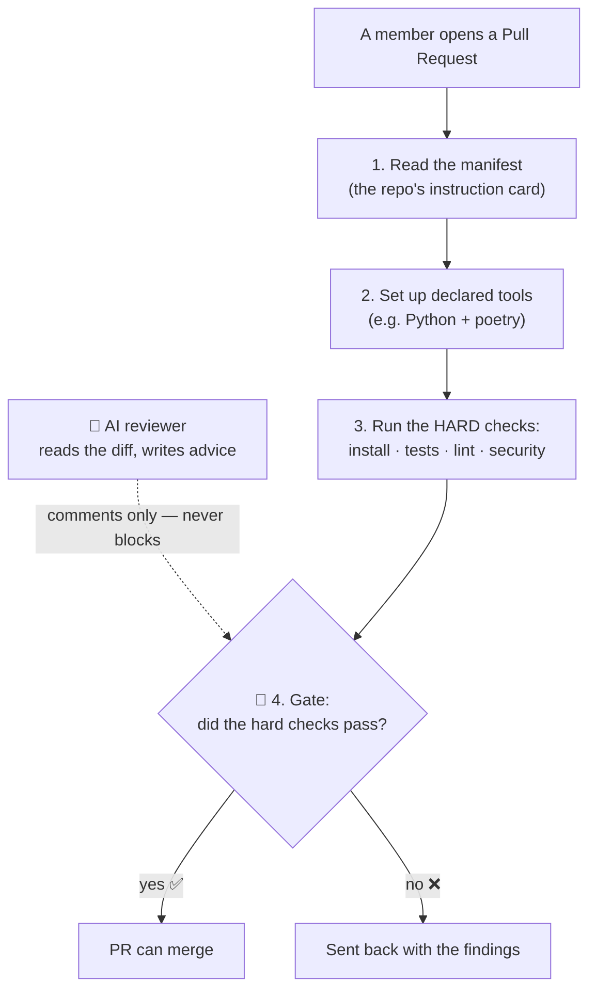
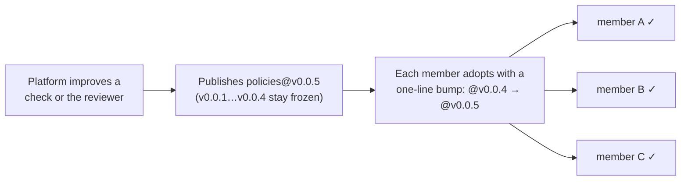

# policies — the rulebook + the robot reviewer

> **Part of 图灵星球 Agent 军团.** New here? Start at the overview: **https://github.com/turingplanet/agent-legion**

This repo is the platform's shared logic. Member repos **reference** it by version (`@vN`) — they never copy it. A change here, published as a new version, reaches any member who bumps to it.

It holds two things:
- **the one review flow** (`.github/workflows/review-reusable.yml`) — the steps every member PR runs.
- **the one standing review agent** (`agent/`) — the AI reviewer (advice only).

## What the review flow does on every PR



The **gate** (the hard checks passing) is what decides pass/fail. The AI reviewer only adds comments — it can never block a merge.

## How a change here reaches everyone



Versions are **frozen tags** (`v0.0.1`, `v0.0.2`, …) protected from being moved — so `@v0.0.4` always means exactly what it meant. Publishing `@v0.0.5` is how a new check or a smarter reviewer ships.

**The "one-line bump", concretely.** In *your own* member repo, edit **`.github/workflows/review.yml`** (your thin pointer) and change the version on the `uses:` line:

```diff
 jobs:
   review:
-    uses: turingplanet/policies/.github/workflows/review-reusable.yml@v0.0.4
+    uses: turingplanet/policies/.github/workflows/review-reusable.yml@v0.0.5
     with:
       contract: v1
```

That single line is the whole adoption — commit it (ideally via a PR, so your own gate runs against the new version), and your next PR uses `@v0.0.5`. You never copy or fork the flow.

(Per the design's migration levers: bump the agent in `agent/` only when a check is AI-judged; everything else is a change to the flow.)

## Publishing a new version (platform-side)

Cutting a new version is just **tagging a commit** — there is no version number inside any file to change.

```bash
# 1. Change the flow (.github/workflows/review-reusable.yml) and/or the agent (agent/).
#    main is protected, so land it via a PR — or push directly with the org-admin bypass.
git commit -am "review flow: <what changed>"

# 2. Cut the version: create a NEW immutable tag and push it.
git tag v0.0.5
git push origin main v0.0.5
```

That's the whole release. `@v0.0.5` resolves to that git tag, and members adopt it with the [one-line bump](#how-a-change-here-reaches-everyone) shown above.

- **Tags are immutable + protected.** Always create a *new* tag (`v0.0.5`); never move or delete an old one — `v0.0.1…v0.0.4` stay frozen forever, so anyone still pinned to them is unaffected. The ruleset allows creating `v*` tags but blocks moving/deleting them.
- **No internal version edits.** The flow checks out the agent at the tag the member used, so tagging `v0.0.5` automatically runs the v0.0.5 agent — you never hardcode a version anywhere in this repo.
- **`contract:` is a different version.** The `contract: v1` input is the *manifest contract* version (bumped only when the manifest schema itself changes), not the policies tag.
