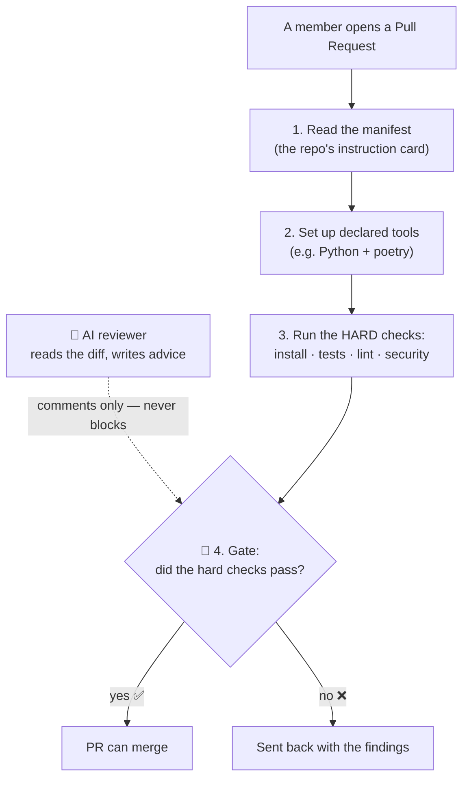
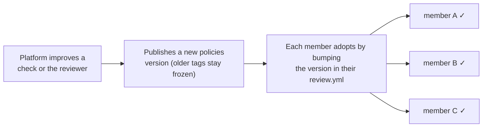

# policies — the rulebook + the robot reviewer

> **Part of 图灵星球 Agent 军团.** New here? Start at the overview: **https://github.com/turingplanet/agent-legion**

This repo is the platform's shared logic. Member repos **reference** it by version (`@vN`) — they never copy it. A change here, published as a new version, reaches any member who bumps to it.

It holds three things:
- **the one review flow** (`.github/workflows/review-reusable.yml`) — the steps every member PR runs. (Not to be confused with `review.yml`: that's the thin *pointer* inside each member repo that *calls* this flow.)
- **the contract schema** (`manifest.schema.json`) — what every member's `agent.manifest.yaml` is validated against. The platform owns it here, versioned with the tag; members don't ship their own.
- **the one standing review agent** (`agent/`) — the AI reviewer (advice only).

## What the review flow does on every PR



The **gate** (the hard checks passing) is what decides pass/fail. The AI reviewer only adds comments — it can never block a merge.

## How a change here reaches everyone



Versions are **frozen tags** (`v0.0.1`, `v0.0.2`, …) protected from being moved — so `@v0.0.4` always means exactly what it meant. Publishing `@v0.0.5` is how a new check or a smarter reviewer ships.

**The version bump, concretely.** In *your own* member repo, edit **`.github/workflows/review.yml`** (your thin pointer) and change the version in **two places** — the `uses:` line and the `policies_ref:` input must match:

```diff
 jobs:
   review:
-    uses: turingplanet/policies/.github/workflows/review-reusable.yml@v0.0.7
+    uses: turingplanet/policies/.github/workflows/review-reusable.yml@v0.0.8
     with:
       contract: v1
-      policies_ref: v0.0.7
+      policies_ref: v0.0.8
```

(Both carry the version because GitHub doesn't tell the flow which version called it — so you state it once for the `uses:` and once as `policies_ref`, which the flow uses to load the matching schema + reviewer.) Commit via a PR so your own gate runs against the new version, then merge. You never copy or fork the flow.

**Do I do this by hand? Will the platform tell me?** You're **pinned and never force-updated** — older tags stay frozen, so you upgrade when ready. Two ways it happens:
- **Automatically:** when a policies change ships through a template release, the [fleet migration bot](https://github.com/turingplanet/agent-registry) opens a PR on your repo making this exact bump. The PR *is* the notification — review and merge it.
- **By hand:** make the two-line edit above yourself, anytime.

## Publishing a new version (platform-side)

Cutting a new version is just **tagging a commit** — there is no version number inside any file to change.

```bash
# 1. Change the flow (.github/workflows/review-reusable.yml) and/or the agent (agent/).
#    main is protected, so land it via a PR — or push directly with the org-admin bypass.
git commit -am "review flow: <what changed>"

# 2. Cut the version: create a NEW immutable tag and push it.
git tag v0.0.5
git push origin main v0.0.5
```

That's the whole release. `@v0.0.5` resolves to that git tag, and members adopt it with the [version bump](#how-a-change-here-reaches-everyone) shown above.

- **Tags are immutable + protected.** Always create a *new* tag (`v0.0.5`); never move or delete an old one — `v0.0.1…v0.0.4` stay frozen forever, so anyone still pinned to them is unaffected. The ruleset allows creating `v*` tags but blocks moving/deleting them.
- **No internal version edits.** There's no version string inside this repo. The flow checks out its schema + agent at the **`policies_ref`** the member passes (which must match their `uses:@vN`) — GitHub doesn't expose the called workflow's own version, so the member states it. Tagging is the only release action here.
- **`contract:` is informational.** The enforced schema is `manifest.schema.json` shipped in the policies version you reference (the contract travels with the tag), so the `contract: v1` input is just a label — reserved for when multiple contract versions need to coexist. It does not change which schema runs.
