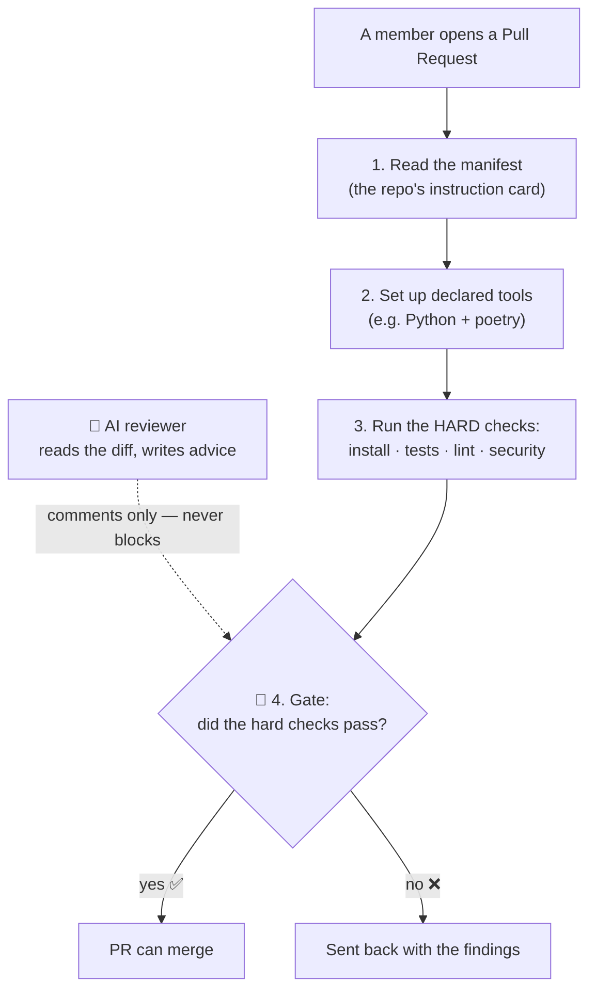
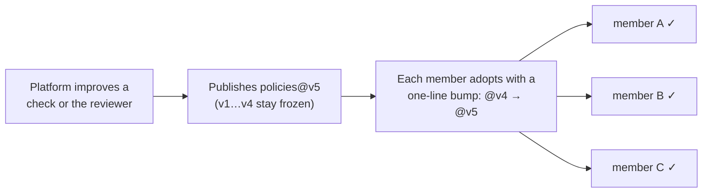

# policies — the rulebook + the robot reviewer

> **Part of 图灵星球 Agent 军团.** New here? Start at the overview: **https://github.com/turingplanet/agent-legion**

This repo is the platform's shared logic. Member repos **reference** it by version (`@vN`) — they never copy it. A change here, published as a new version, reaches any member who bumps to it.

It holds two things:
- **the one review flow** (`.github/workflows/review-reusable.yml`) — the steps every member PR runs.
- **the one standing review agent** (`agent/`) — the AI reviewer (advice only).

## What the review flow does on every PR



The **gate** (the hard checks passing) is what decides pass/fail. The AI reviewer only adds comments — it can never block a merge.

## How a change here reaches everyone



Versions are **frozen tags** (`v1`, `v2`, …) protected from being moved — so `@v4` always means exactly what it meant. Publishing `@v5` is how a new check or a smarter reviewer ships.

**The "one-line bump", concretely.** In *your own* member repo, edit **`.github/workflows/review.yml`** (your thin pointer) and change the version on the `uses:` line:

```diff
 jobs:
   review:
-    uses: turingplanet/policies/.github/workflows/review-reusable.yml@v4
+    uses: turingplanet/policies/.github/workflows/review-reusable.yml@v5
     with:
       contract: v1
```

That single line is the whole adoption — commit it (ideally via a PR, so your own gate runs against the new version), and your next PR uses `@v5`. You never copy or fork the flow.

(Per the design's migration levers: bump the agent in `agent/` only when a check is AI-judged; everything else is a change to the flow.)
